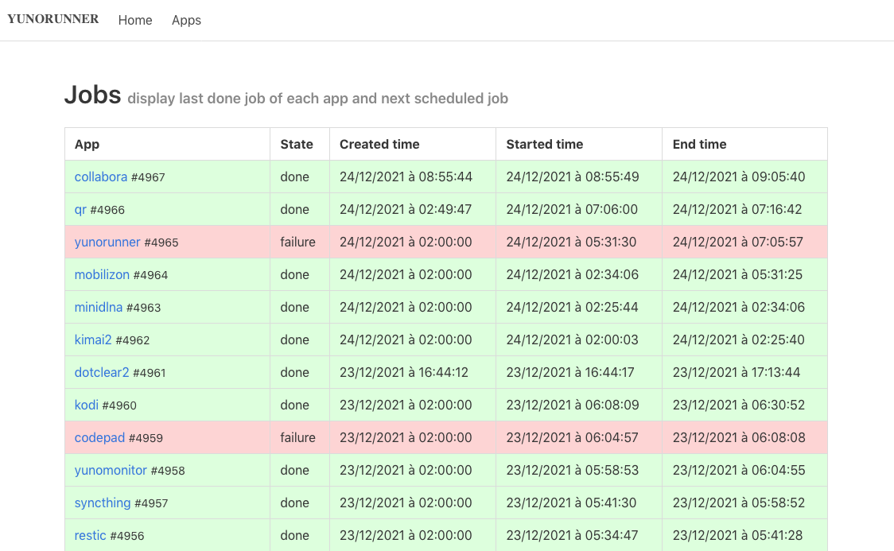

<!--
Este archivo README esta generado automaticamente<https://github.com/YunoHost/apps/tree/master/tools/readme_generator>
No se debe editar a mano.
-->

# YunoRunner para Yunohost

[](https://ci-apps.yunohost.org/ci/apps/yunorunner/)  

[](https://install-app.yunohost.org/?app=yunorunner)

*[Leer este README en otros idiomas.](./ALL_README.md)*

> *Este paquete le permite instalarYunoRunner rapidamente y simplement en un servidor YunoHost.*  
> *Si no tiene YunoHost, visita [the guide](https://yunohost.org/install) para aprender como instalarla.*

## Descripción general

Yunorunner is a CI server for YunoHost apps.

It is based on Incus / LXC and uses [package_check](https://github.com/YunoHost/package_check).


**Versión actual:** 2023.04.05~ynh3

## Capturas



## Documentaciones y recursos

- Repositorio del código fuente oficial de la aplicación : <https://github.com/YunoHost/yunorunner>
- Catálogo YunoHost: <https://apps.yunohost.org/app/yunorunner>
- Reportar un error: <https://github.com/YunoHost-Apps/yunorunner_ynh/issues>

## Información para desarrolladores

Por favor enviar sus correcciones a la [rama `testing`](https://github.com/YunoHost-Apps/yunorunner_ynh/tree/testing).

Para probar la rama `testing`, sigue asÍ:

```bash
sudo yunohost app install https://github.com/YunoHost-Apps/yunorunner_ynh/tree/testing --debug
o
sudo yunohost app upgrade yunorunner -u https://github.com/YunoHost-Apps/yunorunner_ynh/tree/testing --debug
```

**Mas informaciones sobre el empaquetado de aplicaciones:** <https://yunohost.org/packaging_apps>
